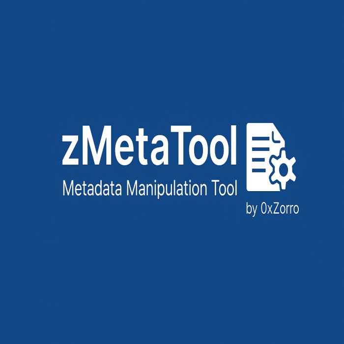

<p align="center">
  
</p>

<p align="right">
  <a href="./README_EN.md">Switch to English version</a>
</p>

# zMetaTool – PDF & JPG Metadata Inspector

**zMetaTool** ist ein praktisches Python-Tool zum Lesen, Löschen oder gezielten Verändern von Metadaten in Dateien. 
Aktuell unterstützt werden PDF-Dateien und JPG-Bilder (inkl. EXIF und GPS-Daten).

> ⚠️ Hinweis: Dieses Tool wurde zu **Lern-, Dokumentations- und Analysezwecken** entwickelt. Nicht zur unautorisierten Manipulation fremder Dateien verwenden!

---

## Features

- Metadaten aus **PDF-Dateien** auslesen, ersetzen oder vollständig löschen
- EXIF-Metadaten aus **JPG-Bildern** anzeigen – inkl. Koordinaten, Kamera, Software etc.
- GPS-Koordinaten werden strukturiert angezeigt (EXIF-kompatibel)
- Beim Löschen wird **immer eine Kopie erstellt** (Original bleibt erhalten)
- Sauberes CLI-Tool mit Argumentparser und Beispielaufrufen
- Erweiterbar für Office-Dateien, PNG u.v.m.

---

## Motivation

Das Projekt entstand aus dem Wunsch, ein leichtgewichtiges, CLI-basiertes Werkzeug zur **Metadateninspektion und -entfernung** bereitzustellen – für IT-Sicherheits- und Datenschutz-Szenarien.

- Wie viele Informationen verraten Dateien "nebenbei"?
- Welche Tools können Metadaten manipulieren?
- Wie lassen sich Koordinaten und Autorenangaben sicher entfernen?

---

## Voraussetzungen

- Python 3.10 oder höher
- Bibliotheken: `PyPDF2`, `Pillow`, `piexif`

Installierbar per:
```bash
pip install PyPDF2 pillow piexif
```

---

## Installation & Start

1. Repository klonen oder Skript herunterladen:
```bash
git clone https://github.com/0xZorro/zMetaTool.git
```

2. Tool aufrufen mit Beispieldateien:
```bash
python zMetaTool.py beispiel.pdf r
python zMetaTool.py foto.jpg r
python zMetaTool.py beispiel.pdf w --metadata "/Title=Demo;/Author=Zorro"
python zMetaTool.py foto.jpg w --metadata "Make=Canon;Model=EOS 90D"
```

---

## Kommandozeilenargumente erklärt

```bash
python zMetaTool.py <datei> <operation> [--metadata "Key=Value;..."]
```

| Argument     | Bedeutung                                                       |
|--------------|------------------------------------------------------------------|
| `datei`      | Pfad zur Eingabedatei (PDF oder JPG)                            |
| `operation`  | `r` = read (lesen), `w` = write (schreiben oder löschen)       |
| `--metadata` | (Optional) zu setzende Metadaten im Format `Key=Value;...`      |

Wenn `--metadata` nicht angegeben ist, werden alle Metadaten entfernt.

---

## Beispiel: Ausgabe von Metadaten

```bash
Title:       Datenschutzbericht
Author:      Max Mustermann
Creator:     LibreOffice 7.3
Producer:    PyPDF2
CreationDate: D:20240512123000
```

```bash
Make:         Canon
Model:        EOS 700D
GPSLatitude:  ((53, 1), (41, 1), (229033, 10000))
GPSLongitude: ((11, 1), (29, 1), (306618, 10000))
```

---

## Dokumentation

- [PDF-Metadaten lesen/schreiben (meta_pdf.md)](./doc_DE/meta_pdf.md)
- [JPG-Metadaten lesen/schreiben (meta_jpg.md)](./doc_DE/meta_jpg.md)

---

## Sicherheitshinweise

Metadaten können sensible Informationen enthalten:

- Aufnahmeorte (GPS)
- Erstellername, Software
- Bearbeitungszeitpunkte

**Dieses Tool hilft, solche Daten sichtbar zu machen und bei Bedarf zu entfernen.**

---

## Zukünftige Erweiterungen

- `--list-fields` Funktion zur Anzeige erlaubter Metadaten pro Dateityp
- Erweiterung für DOCX, XLSX, PNG, TIFF u.a.
- Validierung von Schreibfeldern mit Feedback
- Logging und optionaler Still-Modus (silent)
- Web-Frontend mit Dropzone

---

## Lizenz

Dieses Projekt steht unter der **MIT-Lizenz**. 
Details findest du in der Datei [LICENSE](LICENSE).

---

## Autor

**Created by Jose Luis Ocana**

Cybersecurity Learner | Python & C++ Tools

(GitHub: [0xZorro](https://github.com/0xZorro))  
TryHackMe: https://tryhackme.com/p/0xZorro  
Contact: zorro.jose@gmx.de

---

## Beiträge

Mitarbeit ist willkommen!  
Bitte Fork erstellen, Änderungen vornehmen und Pull Request stellen.

---

## ⚠️ Rechtlicher Hinweis

Dieses Tool dient ausschließlich **zu Bildungs-, Analyse- und Demonstrationszwecken**.  
Es ist nicht dafür gedacht, Metadaten zu verschleiern oder Inhalte irreführend zu verändern.

---

## Haftungsausschluss

Die Nutzung erfolgt auf **eigene Verantwortung**.  
Der Autor übernimmt **keinerlei Haftung** für direkte oder indirekte Schäden, die durch die Anwendung dieses Tools entstehen.  

Verwende zMetaTool nur auf Dateien, für die du **gesetzlich berechtigt** bist, Metadaten zu ändern oder zu löschen.

---

<div align="center">
  
  <br/>
  <sub>© 2025 0xZorro</sub>
</div>

---
